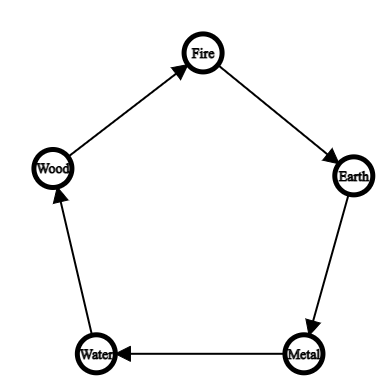
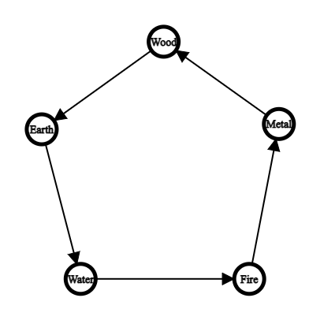

# Elemental Game

This is a turn-based game where two teams of fighters battle until one team remains standing.
It can be played on the terminal.

---

## Unique Mechanics

The most unique mechanic about this game is that elements play an extremely vital role in gameplay.
In this game, both fighters and weapons have elements. The relationship between elements affects how stats come into play.

Other various mechanics include picking up weapons dropped by defeated fighters and healing.
Also, fighters may wield multiple weapons.

---

## Element

The five elements are water, wood, fire, earth, and metal.

There are two types of relationships between elements:
1. Elements may find another element useful as a resource to strengthen itself.
2. Elements may be more effective than another

## Resource Dependency of Elements

The element resource dependency graph can be seen in the following image:


This graph shows the relationship of how specific elements use others.
For example, wood is strengthened by water at the cost of wearing down water.
Here, we call wood the strengthened and wood the weakened element.

In the game, this is reflected by the interactions between fighters and their weapons being used for healing.
If a fighter chooses to heal and their weapon's element is the strengthened element in relation to the fighter's element,
then the healing action is amplified at the cost of reducing the fighter's health.
Also, if the healed person's element is the strengthened element in relation to the healing weapon's element,
then the healing action is amplified at NO cost.

The amplification can stack.

---

## Effectiveness of Elements

The element effectiveness graph can be seen in the following image:


This graph shows the relationship of how some elements are effective on others.
For example, water is effective against fire.

In the game, this is reflected by the interactions between fighters and their weapons being used for attacking.
If an attacker has an element that is effective against the victim's element, then the attacking action is amplified at NO cost.
Also, if the attacker's weapon has an element that is effective against the victim's element, then the attacking action is amplified at NO cost.

The amplfiication can stack.

---

## Running the Game

Change your directory to the elemental-game. Then run make play.

```c++
cd /documents/elemental-game
make play
```

---

## Current Storyline

Currently, the program just runs through one brawl where the user is in a party with two other AI fighting against 3 other AI.

---

## Future plans

In order to expand the game, one could consider 
introducing more fighter types, weapon types, or an all 
new main file (by reworking World.cpp). 
It may be worth expanding the game to have better customization 
features and more players on a team.

---

## Documentation

You can read documentation on the source code in this [`README.md`](src/README.md).

---

## Work Done

Most of the work I did was in [`src/`](src/).
