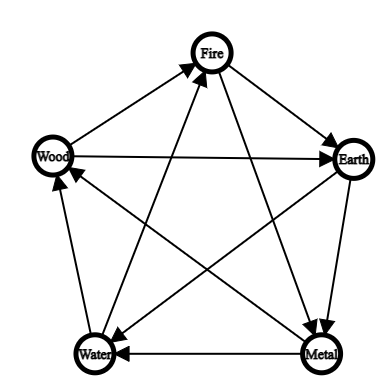

# Elemental Game

This is a turn-based game where two teams of fighters battle until one team remains standing.
It can be played on the terminal.

---

## Unique Mechanics

The most unique mechanic about this game is that elements play an extremely vital role in gameplay.
In this game, both fighters and weapons have elements. The relationship between elements affects how stats come into play.

Other various mechanics include picking up weapons dropped by defeated fighters and healing.
Also, fighters may wield multiple weapons.

---

## Element

The five elements are water, wood, fire, earth, and metal.

There are two types of relationships between elements:
1. Elements may find another element useful as a resource to strengthen itself.
2. Elements may be more effective than another

## Resource Dependency of Elements

The element resource dependency graph can be seen in the following image:


The key to memorizing the resource dependency relationships is thinking about what consumes what (fire consumes wood).

There are two ways this affects mechanics in the game:

1. Heals being stronger (+2, -1) (if weapon->healed or healer->healed). Heals are stronger and users loses health. Heal amplification stacks but health loss does not.
e.g. A healed fire type would be significantly healed by a wood healer with a wood healing weapon.

2. Both heals and attacks are significantly stronger (+4, -2) (if fighter->weapon). If the fighter's element benefits the weapon's element, then both heals and attacks are more far more effective at the cost of making the user weaker.
e.g. A wood weapon would be greatly strengthened by a water fighter.

Healers may die from healing.
---

## Effectiveness of Elements

The element effectiveness graph can be seen in the following image:


The key to memorizing effectiveness relationships is thinking about what eliminates what (water gets rid of fire).

There are two ways this affects mechanics in the game:

1. Attacks being stronger (+2) (if weapon->attacked or attacker->attacked): Attacks are stronger. Attack amplification stacks.
e.g. A fire type would be significantly hurt by a water fighter with a water weapon.

2. Attacks being significantly weaker (-4) (if attacked->weapon or attacked->attacker): Attacks are weaker. Attack amplification stacks.
e.g. A water victim would barely be hurt by a fire fighter with a fire weapon.

---

## Elements Cheatsheet

This is a cheatsheet that combines both of the above graphs.



The pentagon (outside) represents the elements resource dependency graph while the star (inside) represents the elements effectiveness graph.

---

## Running the Game

Change your directory to the elemental-game. Then run make play.

```c++
cd /documents/elemental-game
make play
```

---

## Current Storyline

Currently, the program just runs through one brawl where the user is in a party with two other AI fighting against 3 other AI.

---

## Future plans

In order to expand the game, one could consider 
introducing more fighter types, weapon types, or an all 
new main file (by reworking World.cpp). 
It may be worth expanding the game to have better customization 
features and more players on a team.

---

## Documentation

You can read documentation on the source code in this [`README.md`](src/README.md).

---

## Work Done

Most of the work I did was in [`src/`](src/).
