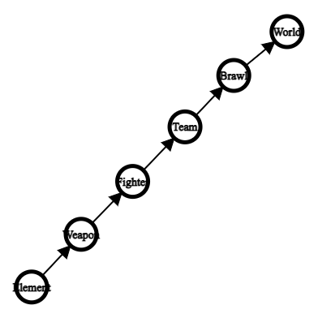

# Source Code Structure

This document explains the code structure of this project.

---

## All Files

The files are the following: 

Brawl, Element, Fighter, Team, Weapon, and World.

Here is a simplified graph showing the general dependencies of all files.

---

## Brawl

Brawl includes Element, Team, and Weapon. It has the Brawl class definition which deals with a particular fight.

---

## Element

Element has the Element class definition which is used to compare all elements.

---

## Fighter

Fighter includes Element and Weapon.
It has the Fighter abstract class definition, where the Fighter can either be a Human (player-controlled) or a Warrior (AI-controlled).

---

## Team

Team includes Fighter. It has the Team class definition which allows Fighter objects to be on the same team.

---

## Weapon

Weapon includes Element.
It has the Weapon abstract class definition, where the Weapon can either be a Staff, Spear, or Cross.

---

## World

World includes Brawl, Element, Fighter, Team, and Weapon. It contains the main function which includes a story line for the game.
